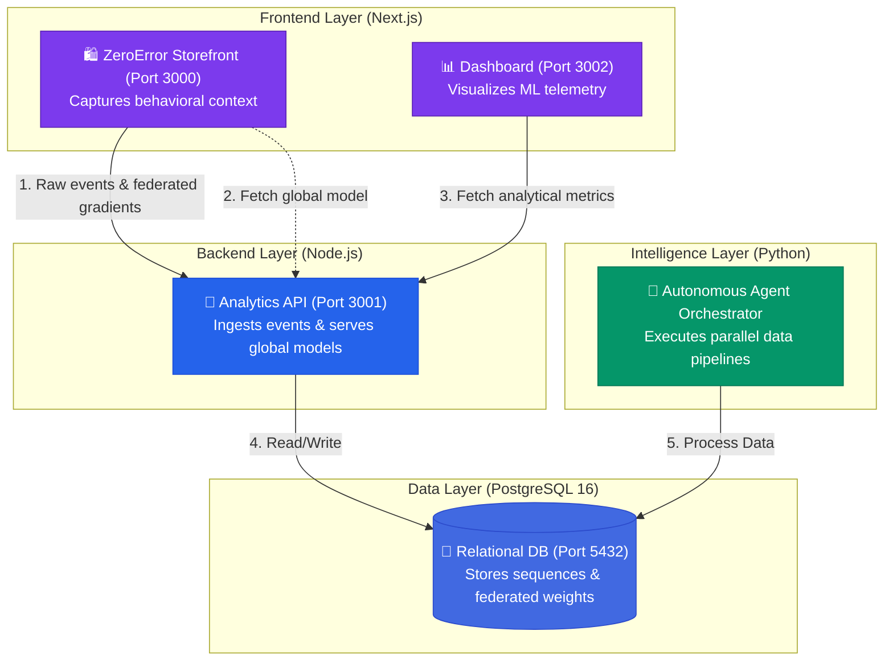
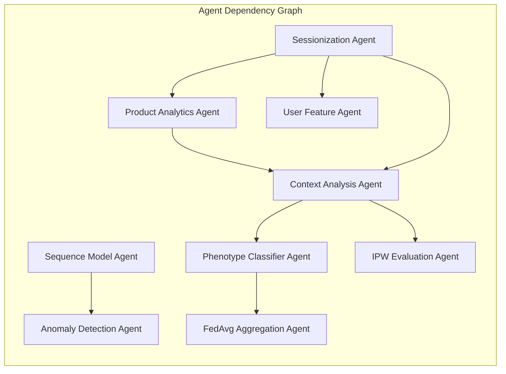

<div align="center">

# Consumer Behavior Analysis & Federated Phenotyping

<p>


</p>

</div>

## Overview

This project is a full-stack behavioral intelligence platform. It tracks user interactions in a live e-commerce environment (via the **ZeroError** storefront) and processes that data through an autonomous, agent-based machine learning pipeline. The project is designed to evaluate consumer decisions using context reconstruction, sequence modeling, and federated learning, providing real-time causal insights without compromising raw user privacy.

---

## 🚀 Key Capabilities

| Capability | Description |
|:---|:---|
| **Autonomous Agent Pipeline** | A Python-based orchestrator that resolves dependencies and executes analytical tasks (sessionization, context analysis, sequence modeling) in parallel. |
| **Federated Phenotyping (FedAvg)** | Groups users into behavioral archetypes using a local logistic regression model trained in the browser. Only sparse gradient updates (delta weights) are sent to the server. |
| **Contextual Decision Reconstruction** | Analyzes what a user saw *before* making a decision (e.g. tracking if a product was viewed immediately after a much cheaper alternative). |
| **Markov Sequence Modeling** | Treats user sessions as state sequences to calculate transition probability matrices and flag anomalous navigational paths. |
| **IPW Causal Inference** | Evaluates the true effectiveness of UI interventions (like discount nudges) using Inverse Probability Weighting to remove selection bias. |

---

## 🏛️ System Architecture

The platform operates across four primary layers: Frontend (Next.js), Backend API (Node.js), Database (PostgreSQL), and the ML Engine (Python).



---

## 🧠 Deep Dive: The Machine Learning Pipeline

### 1. The Autonomous Agent Orchestrator
Rather than running a sequential script, the backend operates as a multi-agent system. If one agent encounters a data shortage, it halts safely while non-dependent agents continue processing.



### 2. Federated Learning (FedAvg) Workflow
To classify users without storing their raw clickstreams centrally, the project implements a federated learning architecture:
1. **Local Training:** The Next.js storefront trains a 15-parameter logistic regression model entirely in the user's browser based on their scrolling and clicking context.
2. **Gradient Extraction:** Upon session exit, the model calculates the top 7 gradient updates (delta weights).
3. **Transmission:** Only these sparse, anonymous mathematical updates are sent to the Node.js API.
4. **Aggregation:** The Python `FedAvg Aggregation Agent` averages these updates into a global model and clusters the gradients to assign users to behavioral phenotypes (e.g., "Comparison Shoppers").

---

## 📡 API Reference

The Node.js backend exposes the following primary endpoints for the Storefront and Dashboard:

| Endpoint | Method | Purpose |
|:---|:---:|:---|
| `/api/events` | `POST` | Ingests raw behavioral events (clicks, views). |
| `/api/context-events` | `POST` | Ingests enriched events containing prior viewing context. |
| `/api/fedavg-update` | `POST` | Receives sparse gradient updates from the browser's local model. |
| `/api/global-model` | `GET` | Serves aggregated global model weights for client initialization. |
| `/api/analytics/agents` | `GET` | Returns execution logs, health, and status of all Python agents. |
| `/api/analytics/phenotypes` | `GET` | Returns behavioral archetypes, cluster centroids, and federated groupings. |
| `/api/analytics/anomalies` | `GET` | Identifies suspicious session paths using Z-Score calculations. |
| `/api/analytics/evaluation` | `GET` | Returns causal evaluation metrics (IPW/CATE) for UI interventions. |

---

## 💻 Getting Started

### Prerequisites
* Docker and Docker Compose (Recommended)
* Node.js v18+ (For manual setup)
* Python 3.10+ (For manual setup)
* PostgreSQL 16+ (For manual setup)

### Option A: Docker Installation (Recommended)

1. Clone the repository and navigate to the `active_project` folder.
2. Run the following command to build and launch all containers:
   ```bash
   docker compose up --build
   ```
3. The services will initialize and become available at:
   * **Storefront:** http://localhost:3000
   * **Dashboard:** http://localhost:3002
   * **Analytics API:** http://localhost:3001
   * **Database:** localhost:5432

### Option B: Manual Setup

If you prefer to run the services natively, follow these steps:

<details>
<summary><b>📋 Expand for step-by-step native instructions</b></summary>

<br/>

#### 1. Database Initialization
Create a PostgreSQL database named `analytics_db` and run the SQL scripts in numerical order:
```bash
psql -U postgres -c "CREATE DATABASE analytics_db;"
psql -U postgres -d analytics_db -f analytics-engine/sql/001_schema.sql
psql -U postgres -d analytics_db -f analytics-engine/sql/002_seed.sql
psql -U postgres -d analytics_db -f analytics-engine/sql/003_sequences.sql
psql -U postgres -d analytics_db -f analytics-engine/sql/004_context.sql
psql -U postgres -d analytics_db -f analytics-engine/sql/005_context_seed.sql
psql -U postgres -d analytics_db -f analytics-engine/sql/006_phenotypes.sql
```

#### 2. Start the Analytics API
```bash
cd analytics-api 
cp .env.example .env 
npm install 
npm run dev
```

#### 3. Execute the Python ML Pipeline
```bash
cd analytics-engine
python -m venv venv
source venv/bin/activate  # On Windows use: .\venv\Scripts\activate
pip install -r requirements.txt
python processors/pipeline.py --mode=full
```

#### 4. Start the Dashboard
```bash
cd dashboard 
cp .env.example .env 
npm install 
npm run dev
```

#### 5. Start the Storefront
```bash
cd storefront 
cp .env.example .env 
npm install 
npm run dev
```

</details>

---

## 📁 Repository Structure

```
.
├── active_project/
│   ├── storefront/                 # Consumer-facing E-commerce UI (ZeroError)
│   │   ├── app/                    # Next.js 14 application routing
│   │   ├── components/             # React UI components and layout
│   │   └── lib/tracking/           # Client-side FedAvg model and event tracker
│   │
│   ├── analytics-api/              # Central Node.js REST API
│   │   ├── app/api/                # API route handlers
│   │   └── lib/                    # Database connection logic
│   │
│   ├── analytics-engine/           # Python Machine Learning Backend
│   │   ├── processors/             # Agent classes, orchestrator, and ML models
│   │   └── sql/                    # Database schema definition and seed files
│   │
│   └── dashboard/                  # Administrative Analytics Panel
│       ├── app/                    # Next.js pages for metrics and monitoring
│       └── components/             # Recharts data visualization elements
└── README.md
```

---

## 📄 License

This project is licensed under the MIT License.
