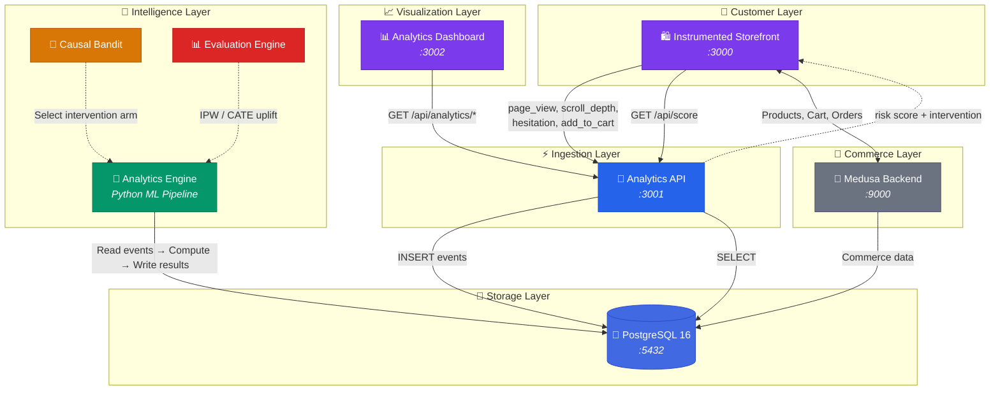
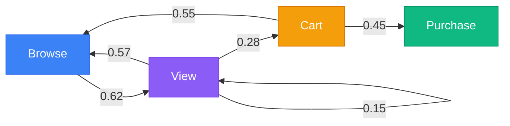
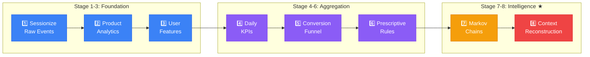
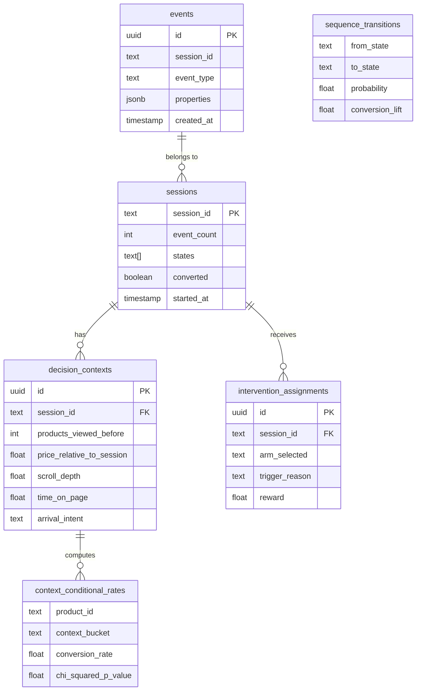

<![CDATA[<div align="center">

<!-- Animated header using capsule render -->


<br/>

<!-- Animated typing effect -->
<a href="https://git.io/typing-svg"></a>

<br/>

<!-- Tech badges -->
<p>


</p>

<!-- Status badges -->
<p>


</p>

</div>

---

## 🧠 What Is This?

An **end-to-end behavioral intelligence platform** built on top of a real MedusaJS e-commerce store. It captures every user micro-interaction, reconstructs the **full decision context** at each moment, models sessions as **Markov chains**, applies **causal machine learning**, and surfaces insights through a research-grade dashboard.

> **The Novel Contribution:** Standard analytics records that a user viewed a product and didn't buy.  
> This system also records *how many products they'd already seen, what prices they'd been exposed to, how expensive this product looked relative to their session history, how long they hesitated, and whether they arrived via search or browse* — then uses causal ML to determine **why** they didn't convert and **intervenes in real-time** to change the outcome.

---

## 🏗️ Architecture



---

## ✨ Key Features

<table>
<tr>
<td width="50%">

### 🔬 Contextual Decision Reconstruction
When a user doesn't convert, standard analytics sees **one event**. This system reconstructs the full situational context:

- 📦 How many products they'd already viewed
- 💰 Price anchoring relative to session history
- ⏱️ Time spent and scroll depth
- 🔍 Search vs. browse arrival intent
- 📉 Context-conditional conversion rates
- 🧪 Chi-squared significance testing

> *Same product viewed first → 31% conversion.*  
> *Viewed after 5 others → 8%. A 4× difference invisible to aggregate metrics.*

</td>
<td width="50%">

### ⛓️ Sequential Behavioral Modeling
Sessions are **Markov chains**, not event counts:



- Transition probability matrices
- Per-transition conversion lift
- Common path mining
- Anomaly detection on low-probability sessions

</td>
</tr>
<tr>
<td width="50%">

### 🎯 Real-time Causal Interventions
A **Contextual Bandit** model detects cognitive friction and triggers UI interventions in real-time:

- 🧠 Detects comparison fatigue, price shock, attention decay
- 💡 Selects optimal intervention (discount, urgency, recommendation)
- 📊 Measures causal uplift with IPW/CATE estimation
- 🔄 Continuously learns from outcomes

</td>
<td width="50%">

### 📊 In-Session Risk Scoring
After every state transition, the tracker calls `/api/score`:

```
User scrolls past fold → tracker detects hesitation
→ Markov scorer: P(abandon) = 0.73
→ Causal Bandit: show "10% off" nudge
→ InterventionProvider renders overlay
→ Outcome logged → bandit updates
```

Hook into it: `tracker.onRiskUpdate(callback)`

</td>
</tr>
</table>

---

## 📁 Repository Structure

```
📦 Realtime-Consumer-Behavior-and-Pattern-Analysis
│
├── 🧠 active_project/                    ★ THE ANALYTICS SYSTEM ★
│   ├── docker-compose.yml                 One-command orchestration
│   │
│   ├── 🛍️ storefront/                    Instrumented e-commerce frontend
│   │   ├── lib/tracking/tracker.ts        Behavioral event capture engine
│   │   ├── lib/analytics/processor.ts     Client-side analytics processor
│   │   ├── components/tracking/           Intervention UI components
│   │   └── app/                           Next.js pages + API routes
│   │
│   ├── 📡 analytics-api/                  Event ingestion + REST API
│   │   ├── app/api/events/                Raw event ingestion
│   │   ├── app/api/score/                 Real-time risk scoring
│   │   ├── app/api/analytics/             9 analytics endpoints
│   │   └── lib/db.ts                      PostgreSQL connection
│   │
│   ├── 🐍 analytics-engine/              Python ML pipeline
│   │   ├── processors/pipeline.py         8-stage processing orchestrator
│   │   ├── processors/sequence_modeler.py Markov chain modeling
│   │   ├── processors/context_analyzer.py Contextual decision reconstruction
│   │   ├── processors/causal_bandit.py    Contextual bandit for interventions
│   │   ├── processors/evaluation_engine.py IPW/CATE causal evaluation
│   │   └── sql/                           6 schema migration files
│   │
│   └── 📊 dashboard/                     Analytics command center
│       ├── app/                           9 dashboard views
│       └── components/charts/             Visualization components
│
├── 🔧 medusa-backend/                    MedusaJS v2 commerce engine
│   └── src/                               Custom modules, API routes, workflows
│
├── 🏪 medusa-backend-storefront/         Medusa storefront template
│   └── src/                               Pages, middleware, modules
│
├── 🛒 app/ + components/ + lib/          Legacy storefront (v1)
└── 📄 .gitignore, package.json, configs
```

---

## 🐍 Analytics Pipeline

The Python engine runs an **8-stage pipeline** that transforms raw events into actionable intelligence:



| Stage | Processor | Input → Output |
|:---:|---|---|
| 1️⃣ | `refresh_sessions` | Raw events → Sessions (30-min inactivity window) |
| 2️⃣ | `refresh_product_analytics` | Sessions → Per-product: views, cart rate, avg time, scroll depth |
| 3️⃣ | `compute_user_features` | Sessions → RFM scores, churn risk, engagement tiers |
| 4️⃣ | `refresh_daily_kpis` | All data → Time-series KPI snapshots |
| 5️⃣ | `refresh_funnel` | Sessions → Funnel state counts (Browse→View→Cart→Purchase) |
| 6️⃣ | `generate_recommendations` | Analytics → Rule-based prescriptive recommendations |
| 7️⃣ | `run_sequence_pipeline` | Sessions → **Markov transition matrices, path mining, anomalies** |
| 8️⃣ | `run_context_pipeline` | Events → **Contextual decision reconstruction, contrastive insights** |

---

## 📊 Dashboard Views

<table>
<tr>
<td align="center" width="33%">
<b>📈 Overview</b><br/>
<sub>Real-time KPIs, session counts, conversion rates, revenue</sub>
</td>
<td align="center" width="33%">
<b>👥 Sessions</b><br/>
<sub>Session timeline, engagement breakdown, duration analysis</sub>
</td>
<td align="center" width="33%">
<b>📦 Products</b><br/>
<sub>Per-product performance, views vs. conversion, engagement heatmap</sub>
</td>
</tr>
<tr>
<td align="center" width="33%">
<b>🔻 Funnel</b><br/>
<sub>Visual conversion funnel with drop-off analysis</sub>
</td>
<td align="center" width="33%">
<b>🗺️ Paths</b><br/>
<sub>Markov chain visualization, common journeys, anomalies</sub>
</td>
<td align="center" width="33%">
<b>🔮 Predictions</b><br/>
<sub>ML churn predictions, engagement forecasting</sub>
</td>
</tr>
<tr>
<td align="center" width="33%">
<b>💡 Recommendations</b><br/>
<sub>Auto-generated prescriptive actions</sub>
</td>
<td align="center" width="33%">
<b>🧠 Context Analysis</b><br/>
<sub>Context-conditional conversion heatmaps, contrastive insights</sub>
</td>
<td align="center" width="33%">
<b>⚗️ Causal Evaluation</b><br/>
<sub>IPW/CATE results, intervention uplift measurement</sub>
</td>
</tr>
</table>

---

## 🚀 Quick Start

### Option 1: Docker (recommended)

```bash
cd active_project
docker compose up --build
```

| Service | URL |
|---|---|
| 🛍️ Storefront | [localhost:3000](http://localhost:3000) |
| 📡 Analytics API | [localhost:3001](http://localhost:3001) |
| 📊 Dashboard | [localhost:3002](http://localhost:3002) |
| 🐘 PostgreSQL | localhost:5432 |

### Option 2: Manual Setup

<details>
<summary><b>Click to expand manual setup instructions</b></summary>

#### 1. Database
```bash
psql -U postgres -c "CREATE DATABASE analytics_db;"
psql -U postgres -d analytics_db -f analytics-engine/sql/001_schema.sql
psql -U postgres -d analytics_db -f analytics-engine/sql/002_seed.sql
psql -U postgres -d analytics_db -f analytics-engine/sql/003_sequences.sql
psql -U postgres -d analytics_db -f analytics-engine/sql/004_context.sql
psql -U postgres -d analytics_db -f analytics-engine/sql/005_context_seed.sql
```

#### 2. Analytics API (port 3001)
```bash
cd active_project/analytics-api
cp .env.example .env
npm install && npm run dev
```

#### 3. Python ML Pipeline
```bash
cd active_project/analytics-engine
python -m venv venv && source venv/bin/activate   # or .\venv\Scripts\activate on Windows
pip install -r requirements.txt
python processors/pipeline.py --mode=full
```

#### 4. Dashboard (port 3002)
```bash
cd active_project/dashboard
cp .env.example .env
npm install && npm run dev
```

#### 5. Storefront (port 3000)
```bash
cd active_project/storefront
cp .env.example .env
npm install && npm run dev
```

</details>

### Medusa Commerce Backend

<details>
<summary><b>Click to expand Medusa setup instructions</b></summary>

The Medusa backend powers the actual e-commerce functionality (products, orders, carts):

```bash
cd medusa-backend
cp .env.example .env    # Configure DATABASE_URL, CORS, JWT secrets
npm install
npx medusa develop      # Starts on localhost:9000
```

The Medusa storefront:
```bash
cd medusa-backend-storefront
cp .env.local.example .env.local
npm install
npm run dev             # Starts on localhost:8000
```

</details>

---

## 🧪 API Reference

<details>
<summary><b>📡 Analytics API Endpoints</b></summary>

| Method | Endpoint | Description |
|:---:|---|---|
| `POST` | `/api/events` | Ingest raw behavioral events |
| `POST` | `/api/context-events` | Ingest enriched context events |
| `GET` | `/api/score` | Real-time session risk scoring |
| `GET` | `/api/analytics/summary` | Aggregated KPIs |
| `GET` | `/api/analytics/products` | Per-product performance |
| `GET` | `/api/analytics/funnel` | Conversion funnel data |
| `GET` | `/api/analytics/paths` | Markov chain paths |
| `GET` | `/api/analytics/predictions` | Churn/engagement predictions |
| `GET` | `/api/analytics/recommendations` | Prescriptive recommendations |
| `GET` | `/api/analytics/context` | Contextual decision analysis |
| `GET` | `/api/analytics/evaluation` | Causal evaluation (IPW/CATE) |
| `GET` | `/api/analytics/interventions` | Intervention decisions |

</details>

---

## 🗄️ Database Schema



---

## 🛠️ Tech Stack

<div align="center">

| Layer | Technology | Purpose |
|:---:|:---:|---|
| 🛍️ Storefront | Next.js 14, TypeScript | Instrumented e-commerce frontend |
| 📡 API | Next.js API Routes, `pg` | Event ingestion, analytics serving |
| 🐍 ML Engine | Python, NumPy, SciPy | Markov chains, causal ML, statistical tests |
| 💾 Database | PostgreSQL 16 | Event storage, computed analytics |
| 📊 Dashboard | Next.js 14, Tailwind CSS | Analytics visualization |
| 🏪 Commerce | MedusaJS v2 | Headless commerce (products, orders, carts) |
| 🐳 DevOps | Docker Compose | Multi-service orchestration |

</div>

---

## 🚢 Deployment

| Component | Platform | Tier |
|---|---|---|
| Storefront + Dashboard | Vercel | Free |
| Analytics API | Fly.io | Free |
| Python Engine | Fly.io | Free |
| PostgreSQL | Fly.io / Neon.tech | Free |

---

## 📄 License

This project is licensed under the [MIT License](license.md).

---

<div align="center">


<sub>Built with 💜 for research-grade behavioral analytics</sub>

</div>
]]>
