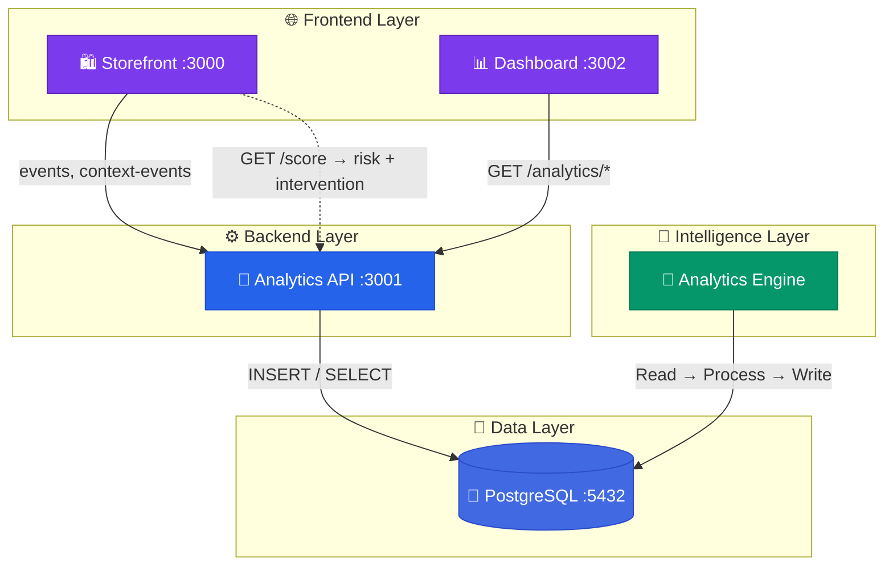
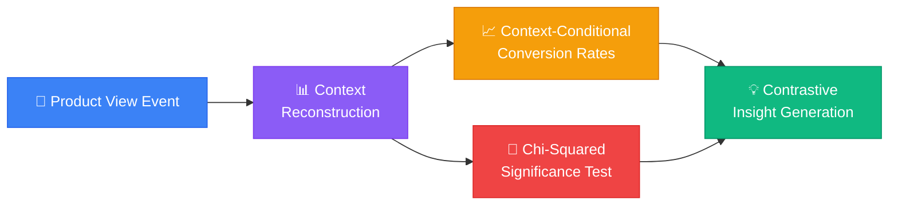
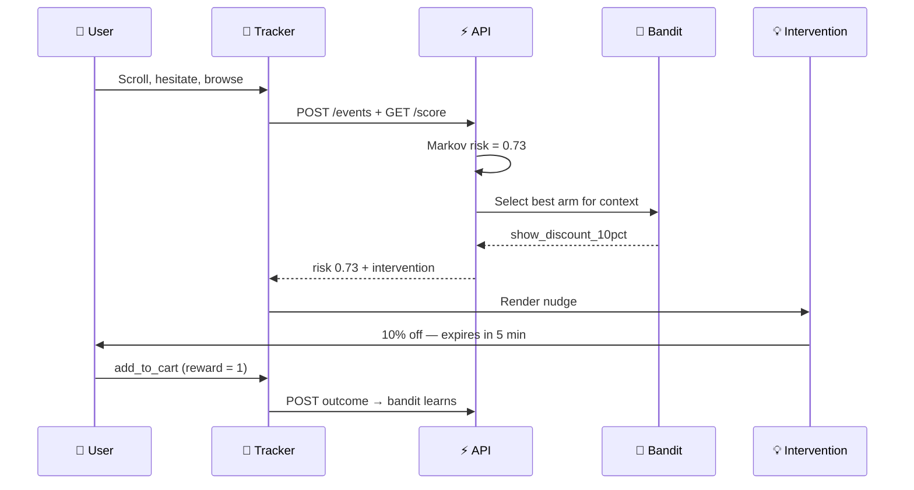
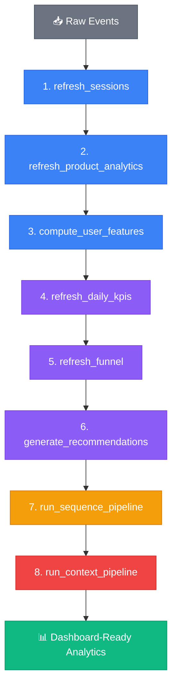

<div align="center">


<p>


</p>

</div>

---

## 🔍 Overview

This is the **core analytics system** — a self-contained behavioral intelligence platform that sits alongside the Medusa e-commerce infrastructure. It captures every user micro-interaction, processes it through ML pipelines, and surfaces insights that explain **why** users behave the way they do.

---

## 🏛️ Services



| Service | Port | Language | Role |
|:---|:---:|:---:|---|
| **Storefront** | 3000 | TypeScript / Next.js | Instrumented e-commerce frontend with behavioral tracker |
| **Analytics API** | 3001 | TypeScript / Next.js | Event ingestion, risk scoring, analytics REST API |
| **Dashboard** | 3002 | TypeScript / Next.js | 9-view analytics command center |
| **Analytics Engine** | — | Python | 8-stage ML processing pipeline |
| **PostgreSQL** | 5432 | SQL | Event storage + computed analytics |

---

## 🧠 The Three Novel Layers

### 1️⃣ Contextual Decision Reconstruction

> *Standard analytics:* "User viewed Product A and didn't buy."
> *This system:* "User viewed Product A **after** seeing 5 cheaper products, making it look 40% more expensive than their session average. Attention depth was shallow (23% scroll). Arrived via browse, not search. **Context-conditional conversion: 8% vs. 31% if viewed first.**"



**Insight types generated:** `comparison_fatigue`, `price_anchor_high`, `price_anchor_low`, `first_impression`, `attention_depth`, `search_intent`, `category_saturation`

### 2️⃣ Sequential Behavioral Modeling (Markov Chains)

Sessions are **state sequences**, not event counts:

```
[Browse] → [View] → [View] → [Cart] → [View] → [Purchase]
```

The sequence modeler computes:

- **Transition probability matrices** — P(Cart | View) = 0.28
- **Per-transition conversion lift** — Cart→Purchase has 2.3× lift over baseline
- **Common path mining** — Top 10 most frequent session paths
- **Anomaly detection** — Flag sessions with unusually low cumulative probability

### 3️⃣ Causal Intervention Engine



**Evaluation:** Uses **Inverse Probability Weighting (IPW)** and **Conditional Average Treatment Effect (CATE)** to rigorously measure whether interventions caused the outcome vs. what would have happened anyway.

---

## 📡 API Reference

| Method | Endpoint | Description |
|:---:|---|---|
| `POST` | `/api/events` | Ingest raw behavioral events from tracker |
| `POST` | `/api/context-events` | Ingest enriched events with decision context |
| `GET` | `/api/score` | Real-time Markov-based abandonment risk |
| `GET` | `/api/analytics/summary` | Aggregated KPIs (sessions, CVR, AOV) |
| `GET` | `/api/analytics/products` | Per-product engagement analytics |
| `GET` | `/api/analytics/funnel` | Conversion funnel (Browse→View→Cart→Purchase) |
| `GET` | `/api/analytics/paths` | Markov transitions + common paths |
| `GET` | `/api/analytics/predictions` | Churn risk + engagement predictions |
| `GET` | `/api/analytics/recommendations` | Auto-generated prescriptive actions |
| `GET` | `/api/analytics/context` | Contextual decision analysis results |
| `GET` | `/api/analytics/evaluation` | Causal intervention evaluation (IPW/CATE) |
| `GET` | `/api/analytics/interventions` | Real-time intervention arm decisions |

---

## 🐍 Pipeline Deep Dive



**Scheduling:** Docker runs `--mode=full` at startup, then `--mode=incremental` every 15 minutes.

---

## 🚀 Quick Start

### Docker (one command)

```bash
docker compose up --build
```

```
✅ Storefront    → http://localhost:3000
✅ Analytics API → http://localhost:3001
✅ Dashboard     → http://localhost:3002
✅ PostgreSQL    → localhost:5432
```

### Manual Setup

<details>
<summary><b>📋 Step-by-step instructions</b></summary>

<br/>

#### Database

```bash
psql -U postgres -c "CREATE DATABASE analytics_db;"
psql -U postgres -d analytics_db -f analytics-engine/sql/001_schema.sql
psql -U postgres -d analytics_db -f analytics-engine/sql/002_seed.sql
psql -U postgres -d analytics_db -f analytics-engine/sql/003_sequences.sql
psql -U postgres -d analytics_db -f analytics-engine/sql/004_context.sql
psql -U postgres -d analytics_db -f analytics-engine/sql/005_context_seed.sql
```

#### Analytics API

```bash
cd analytics-api && cp .env.example .env && npm install && npm run dev
```

#### Python Pipeline

```bash
cd analytics-engine
python -m venv venv
source venv/bin/activate       # Windows: .\venv\Scripts\activate
pip install -r requirements.txt
python processors/pipeline.py --mode=full
```

#### Dashboard

```bash
cd dashboard && cp .env.example .env && npm install && npm run dev
```

#### Storefront

```bash
cd storefront && cp .env.example .env && npm install && npm run dev
```

</details>

---

## 📁 File Map

```
active_project/
├── docker-compose.yml              # 5-service orchestration
│
├── storefront/                     # Instrumented storefront (:3000)
│   ├── app/
│   │   ├── page.tsx                    Homepage with product grid
│   │   ├── product/[handle]/           Product detail page
│   │   ├── search/                     Search functionality
│   │   ├── dashboard/page.tsx          Embedded mini-dashboard (37KB)
│   │   └── api/                        Proxy API routes
│   ├── components/tracking/
│   │   ├── InterventionProvider.tsx     ★ Real-time intervention UI
│   │   ├── page-tracker.tsx            Auto page_view events
│   │   └── product-view-tracker.tsx    Detailed product_view events
│   └── lib/
│       ├── tracking/tracker.ts         ★ Core behavioral tracker (15KB)
│       ├── analytics/processor.ts      Client-side analytics (13KB)
│       └── db.ts                       Database connection
│
├── analytics-api/                  # REST API (:3001)
│   ├── app/api/
│   │   ├── events/route.ts             POST — raw event ingestion
│   │   ├── context-events/route.ts     POST — enriched context events
│   │   ├── score/route.ts              GET — real-time risk scoring
│   │   └── analytics/
│   │       ├── summary/route.ts        GET — aggregated KPIs
│   │       ├── products/route.ts       GET — product performance
│   │       ├── funnel/route.ts         GET — conversion funnel
│   │       ├── paths/route.ts          GET — Markov paths
│   │       ├── predictions/route.ts    GET — ML predictions
│   │       ├── recommendations/        GET — prescriptive actions
│   │       ├── context/route.ts        GET — decision context
│   │       ├── evaluation/route.ts     GET — causal evaluation
│   │       └── interventions/route.ts  GET — intervention decisions
│   └── lib/db.ts                   PostgreSQL pool
│
├── analytics-engine/               # Python ML pipeline
│   ├── processors/
│   │   ├── pipeline.py                 ★ 8-stage orchestrator (25KB)
│   │   ├── sequence_modeler.py         ★ Markov chains (22KB)
│   │   ├── context_analyzer.py         ★ Decision reconstruction (29KB)
│   │   ├── causal_bandit.py            ★ Contextual bandit (4KB)
│   │   └── evaluation_engine.py        ★ IPW/CATE evaluation (41KB)
│   ├── sql/
│   │   ├── 001_schema.sql              Core tables
│   │   ├── 002_seed.sql                Sample data
│   │   ├── 003_sequences.sql           Markov chain tables
│   │   ├── 004_context.sql             Decision context tables
│   │   └── 005_context_seed.sql        Sample context data
│   └── requirements.txt           Python dependencies
│
└── dashboard/                      # Analytics UI (:3002)
    ├── app/
    │   ├── page.tsx                    Overview KPIs
    │   ├── sessions/                   Session analysis
    │   ├── products/                   Product performance
    │   ├── funnel/                     Conversion funnel
    │   ├── paths/                      Markov visualization
    │   ├── predictions/                Churn forecasting
    │   ├── recommendations/            Prescriptive actions
    │   ├── context/                    ★ Contextual decision analysis
    │   ├── evaluation/                 ★ Causal evaluation (IPW/CATE)
    │   └── interventions/              ★ Intervention monitoring
    └── components/
        ├── charts/                    Chart components
        └── layout/                    Navigation, sidebar
```

---

## 📄 License

MIT

<div align="center">


</div>
